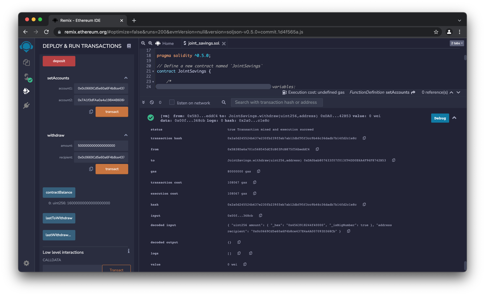

# Joint Savings Smart Contract

This repo contains a Solidity smart contract that implements a joint savings account.

The smart contract allows for creation of an account that uses two user addresses.  It uses ether management functions to provide the features of the joint savings account, which include getting information about the account, as well as the ability to deposit and withdraw funds.

---

## Technologies

Solidity: The smart contract is written in Solidity and compatible with Ethereum-based blockchains.

---

## Installation Guide

This smart contract can be compiled and deployed, and tested using the JavaScript VM in the Ethereum Remix IDE.

See the **Examples** section below for results of testing the contract in this way.  

---

## Examples

### Testing, Step 1

Result of using the `setAccounts` function to set two user addresses for the joint account:

### Testing, Step 2

Result of depositing 1 ether as wei:

Checking the contract balance after depositing 1 ether as wei:

Result of depositing 10 ether as wei:

Checking the contract balance after depositing 10 ether as wei:

Result of depositing 5 ether:

Checking the contract balance after depositing 5 ether:

### Testing, Step 3

Result of withdrawing 5 ether to account 1:

Checking the contract balance after withdraw to account 1:

Checking the last address to withdraw after withdraw to account 1:

Checking the last withdraw amount after withdraw to account 1:

Result of withdrawing 10 ether to account 2:

Checking the contract balance after withdraw to account 2:

Checking the last address to withdraw after withdraw to account 2:

Checking the last withdraw amount after withdraw to account 2:

---

## Contributors

Michael Danenberg

---

## License

MIT